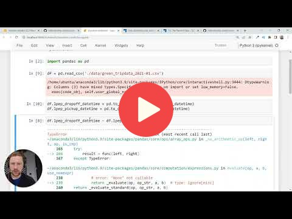
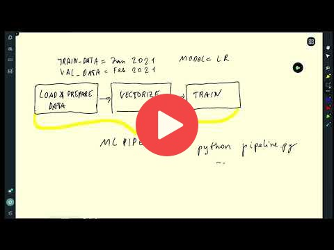

# 1. Introduction

Instructor: Alexey Grigorev

Source: https://github.com/DataTalksClub/mlops-zoomcamp

## 1.1 Introduction

<a href="https://www.youtube.com/watch?v=s0uaFZSzwfI&list=PL3MmuxUbc_hIUISrluw_A7wDSmfOhErJK">
  
</a>


## 1.2 Environment preparation

**Note**: You don't have to rent an instance in the cloud. You can follow the same instructions 
for setting up your local environment. 

<a href="https://www.youtube.com/watch?v=IXSiYkP23zo&list=PL3MmuxUbc_hIUISrluw_A7wDSmfOhErJK">
  
</a>

## MLOPS conda Environment Preparation Cloud or Local

**Note**: You don't have to rent an instance in the cloud. Skip the Cloud Steps go to Environment Steps, then You can follow the same instructions 
for setting up your local environment. `Recommended development environment: Mac, Linux, WSL on Windows`. Another Option: Windows.


## Cloud Steps:

### Cloud Step 1: Create an AWS Account for EC2 Instance.
- https://portal.aws.amazon.com/billing/signup#/start/email
- https://console.aws.amazon.com/console/home
- Build EC2 Instance: Ubuntu Linux with free tier configuration
	- Give Name EC2 Instance: mlops-... 
	- t2.micro (free tier)
	- Build or Select SSH Key: *.pem file 
	- Disk Space: 30 GB (max free tier)
- Start Created EC2 Instance

#### or Create an Deploifai (on AWS, Azure, or GCP) Account.
- https://github.com/98sean98/mlops-zoomcamp/blob/main/01-intro/deploifai-server/readme.md

#### or Create an Google Cloud Account.
- https://cloud.google.com/
- https://github.com/piyush-an/MLOps-ZoomCamp/blob/main/01-Introduction/infrastructure.md


### Cloud Step 2: Connect Amazon Ubuntu EC2 Instance

#### Cloud Step 2.1: Open Local Terminal or GIT Bash on Mac, Linux, WSL on Windows

```sh
# For Windows Git Bash to Connect WSL
wsl
```

#### Cloud Step 2.2: Update existing local packages 

```sh
# Update existing local packages
sudo apt update
```

#### Cloud Step 2.3: Check local home folder

```sh
# Go to local HOME folder
cd
```
```sh  
# Check local directory is in HOME folder
pwd
```
```sh  
# Check local HOME folders inside
ls -al
```

#### Cloud Step 2.4: Create local .ssh folder, then copy in ssh key *.pem

```sh
# Create local .ssh folder in HOME folder
mkdir -p .ssh
```
```sh  
# Go to local .ssh folder
cd .ssh/
```
```sh  
# Copy local *.pem key to in .ssh folder
cp "pem key path" .
```
```sh 
# or Copy Manual local mac, linux, wsl on windows
open .
```
```sh 
# or Copy Manual local wsl
explorer.exe .
```
```sh 
# or Copy Manual local linux
sudo apt install nautilus -y
nautilus .
```

**Note**: If you get `It is required that your private key files are NOT accessible by others. This private key will be ignored.` error, you should change permits on the downloaded file to protect your private key:

```sh 
# for local ssh pem key permission error
chmod 400 ~/.ssh/name-of-your-private-key-file.pem
```

#### Cloud Step 2.5: Configure local ssh Connection

```sh
# Build local ssh config File with nano editor in .ssh folder
nano ~/.ssh/config
```
```sh 
# Copy Configuration in local nano editor, then Save it! 
Host mlops-zoomcamp                                         # ssh connection calling name
    User ubuntu                                             # username AWS EC2
    HostName <instance-public-IPv4-addr>                    # Public IP, it changes when Source EC2 is turned off.
    IdentityFile ~/.ssh/name-of-your-private-key-file.pem   # Private SSH key file path
    LocalForward 8888 localhost:8888                        # Connecting to a service on an internal network from the outside, static forward or set port user forward via on vscode 
    StrictHostKeyChecking no   
```
  
#### Cloud Step 2.6: Connect Created EC2 Instance

```sh  
# Connect Created EC2 Instance
ssh mlops-zoomcamp
```
```sh 
# Check USER is Connected EC2
whoami
```
```sh 
# for exit from AWS EC2 
logout
```

## Environment Steps:   

### Step 1: Download and install the Anaconda distribution of Python.

```sh
# Download
wget https://repo.anaconda.com/archive/Anaconda3-2022.05-Linux-x86_64.sh
```
```sh 
# Setup - Attention make sure after installing type yes for AUTO connect conda enviroment 
bash Anaconda3-2022.05-Linux-x86_64.sh
```
```sh 
# exit AWS EC2 or mac, linux, WSL on Windows
logout
```
```sh 
# Cloud: connect and check ACTIVE environment conda base on AWS EC2
ssh mlops-zoomcamp
```
```sh 
# Local: connect and check ACTIVE environment conda base on Mac, Linux: close and reopen mac, linux terminal
# Local: connect and check ACTIVE environment conda base on WSL on Windows
wsl
```

### Step 2: Update existing packages

```sh
sudo apt update
```

### Step 3: Install Docker
- https://www.simplilearn.com/tutorials/docker-tutorial

```sh
sudo apt install docker.io
```

To run docker without `sudo`:

```sh
sudo groupadd docker
sudo usermod -aG docker $USER
```

### Step 4: Install Docker Compose
- https://www.simplilearn.com/tutorials/docker-tutorial/docker-compose#GoTop

Install docker-compose in a separate directory

```sh
mkdir -p ~/soft && cd ~/soft
```

To get the latest release of Docker Compose, go to https://github.com/docker/compose and download the release for your OS.

```sh
wget https://github.com/docker/compose/releases/download/v2.5.0/docker-compose-linux-x86_64 -O docker-compose
```

Make it executable

```sh
chmod +x docker-compose
```

Add to the `soft` directory to `PATH`. Open the `.bashrc` file with `nano`:

```sh
nano ~/.bashrc
```

In `.bashrc`, add the following line:

```bash
export PATH="${HOME}/soft:${PATH}"
```

Save it and run the following to make sure the changes are applied:

```bash
source ~/.bashrc
```

### Step 5: Run Docker

**Note**: If you get `docker: Got permission denied while trying to connect to the Docker daemon socket at unix:///var/run/docker.sock: Post "http://%2Fvar%2Frun%2Fdocker.sock/v1.24/containers/create": dial unix /var/run/docker.sock: connect: permission denied.` error, restart your VM instance. 

```sh
docker run hello-world
```

### Step 6: Run jupyter notebook

- **Ready For Any Project**

```sh
# go to wsl home 
cd
```
```sh 
# for WSL - go to local HOME windows
cd /mnt/c/Users/your-windows-username
```
```sh 
# create folder jupyter_notebook in HOME folder, then go
mkdir -p jupyter_notebook && cd jupyter_notebook
```
```sh 
# run jupyter notebook
jupyter notebook
```
```sh 
# for WSL - Close Tilix: Terminal 
# Click to any Link access the notebook on Terminal with Ctrl+
```

### Step 7: Open new Notebook with Python Kernel

```sh
# Python Version Check
!python -V
```
```sh 
# Python path check
!which python
```
```sh 
# EC2 install Tensorflow 200+ mb
!pip install tensorflow-cpu
# or 500+ mb
!pip install tensorflow --no-cache-dir
```
```sh 
# check and repair packages conflict
!conda update --all
```
```sh 
# check and repair packages conflict
!conda update --all
```

## 1.3 (Optional) Training a ride duration prediction model

**Note**: The NYC taxi data is now in parquet format, not CSV.
Here's a [video](https://www.youtube.com/watch?v=r94QjpX9vSE&list=PL3MmuxUbc_hIUISrluw_A7wDSmfOhErJK) that explains how to 
read parquet data.

<a href="https://www.youtube.com/watch?v=iRunifGSHFc&list=PL3MmuxUbc_hIUISrluw_A7wDSmfOhErJK">
  
</a>

Links:

* [Notebook](duration-prediction.ipynb)


## 1.4 Course overview

<a href="https://www.youtube.com/watch?v=teP9KWkP6SM&list=PL3MmuxUbc_hIUISrluw_A7wDSmfOhErJK">
  
</a>


## 1.5 MLOps maturity model

<a href="https://www.youtube.com/watch?v=XwTH8BDGzYk&list=PL3MmuxUbc_hIUISrluw_A7wDSmfOhErJK">
  
</a>

Links: 

* [MLOps Maturity model](https://docs.microsoft.com/en-us/azure/architecture/example-scenario/mlops/mlops-maturity-model)


## 1.6 Homework

More information [here](../cohorts/2023/01-intro/homework.md).


## Notes

Did you take notes? Add them here:

* [Local MacOS envprep by Adetbekov](https://github.com/adetbekov/mlops-zoomcamp/blob/main/01-intro/macos-local-envprep.md)
* [Environment Setup by Ayoub](https://github.com/ayoub-berdeddouch/mlops-journey/blob/main/intro-01.md)
* [Intro, Environment Setup, and MLOps Maturity Models by Bala](https://github.com/balapriyac/DTC-MLOps-Zoomcamp/tree/main/week1)
* [GCP Environment Setup by Piyush](https://github.com/piyush-an/MLOps-ZoomCamp/blob/main/01-Introduction/infrastructure.md)
* [Microsoft Azure Environment Setup by Olaide](https://github.com/josepholaide/MLOps-Practice/blob/main/Week%201/README.md)
* [Environment Preparation using GCP and pyenv by Dani](https://github.com/syahrulhamdani/dtc-mlops/blob/main/week-1-introduction/README.md)
* [Useful links by Zioalex](https://github.com/zioalex/mlops-zoomcamp/blob/main/My_notes_week1.md)
* [Notes by Alvaro Navas](https://github.com/ziritrion/mlopszoomcamp/blob/main/notes/1_intro.md)
  * [Environment setup on GCP (recycled from Data Engineering Zoomcamp)](https://gist.github.com/ziritrion/3214aa570e15ae09bf72c4587cb9d686)
  * [Docker cheatsheet](https://gist.github.com/ziritrion/1842c8a4c4851602a8733bba19ab6050)
  * [Conda cheatsheet](https://gist.github.com/ziritrion/8024025672ea92b8bdeb320d6015aa0d)
  * [Git cheatsheet](https://gist.github.com/ziritrion/d73ca65bf4d19c79ca842a55853cb962)
  * [Python and data libraries cheatseet](https://gist.github.com/ziritrion/9b80e47956adc0f20ecce209d494cd0a)
* [Cloud server setup using Deploifai (on AWS, Azure, or GCP) by 98sean98](https://github.com/98sean98/mlops-zoomcamp/blob/main/01-intro/deploifai-server/readme.md)
* [Notes from first lesson by Neimv](https://gitlab.com/neimv/mlops/-/blob/main/lessons_weeks/notes_1.md)
* [Course preliminaries (jupyterbook) by particle1331](https://particle1331.github.io/ok-transformer/nb/mlops/01-intro.html)
* [Notes by Francisco Delca (environment: local ubuntu + virtualvenv)](https://github.com/FDelca/mlops_datatalks_notes/blob/main/Week1/Week1-LearningNotes.ipynb)
* [What is MLOps? - Non-technical intro by Lorenz](https://github.com/LoHertel/Road-to-MLOps/blob/main/01-primer/README.md)
* [Notes for Week1 by Bhagabat](https://github.com/BPrasad123/MLOps_Zoomcamp/tree/main/Week1)
* [What is MLOps? - Storytime by Pathik Ghugare](https://github.com/pathikg/MLOps-Zoomcamp-DataTalks/blob/main/week-01-introduction/MLOps-Introduction.md)
* [Module 1 Notes by Stephen Barrie](https://stephen137.github.io/posts/MLOps_Zoomcamp_Week_1/MLOps_Zoomcamp_Week_1.html)
* Send a PR, add your notes above this line

* [Building and Scaling a Machine Learning Platform - Magdalena Kuhn](https://www.youtube.com/watch?v=bNrBJwiLBWU)


## Useful Scripts

### Install or update the AWS CLI
- https://docs.aws.amazon.com/cli/latest/userguide/getting-started-install.html

```sh
curl "https://awscli.amazonaws.com/awscli-exe-linux-x86_64.zip" -o "awscliv2.zip"
sudo apt install unzip -y
unzip awscliv2.zip
sudo ./aws/install
```
```sh
# IAM > Security credentials > Create access key
# Use access keys to send programmatic calls to AWS from the AWS CLI
aws configure
```

### AWS EC2 IP Updater for SSH Configuration

**Note**: This script automatically updates the IP address of your EC2 instance in your SSH config file. This can be useful if your instance's IP address changes frequently (for example, when stopping and starting an EC2 instance).

```sh
# open and save the following bash script for AWS EC2 ip update:
nano ~/.ssh/update_ssh_config.sh
```

Save the following bash script in a file named `update_ssh_config.sh`, replacing `your_instance_id_here` with your actual AWS EC2 instance ID:

```sh
#!/bin/bash
INSTANCE_ID=your_instance_id_here
REGION=us-east-1

# Get the new public IP address of the EC2 instance
NEW_IP=$(aws ec2 describe-instances  --instance-ids $INSTANCE_ID  --region $REGION --query 'Reservations[0].Instances[0].PublicIpAddress' --output text)

# Define the config template
read -r -d '' SSH_CONFIG << EOM

# Updated Configuration in local .ssh/config
Host mlops-zoomcamp                         # ssh connection calling name
    User ubuntu                             # username AWS EC2
    HostName $NEW_IP                        # Public IP, it changes when Source EC2 is turned off.
    IdentityFile ~/.ssh/mlops-zoomcamp.pem  # Private SSH key file path
    LocalForward 8888 localhost:8888        # Connecting to a service on an internal network from the outside, static forward or set port user forward via on vscode
    StrictHostKeyChecking no
EOM

# Write the new SSH config
echo "$SSH_CONFIG" > ~/.ssh/config
echo "Updated IP: $NEW_IP"
```

```sh
# Make the script executable
chmod +x ~/.ssh/update_ssh_config.sh
```

```sh
# Run the script update: AWS EC2 IP Adress
~/.ssh/update_ssh_config.sh
```
